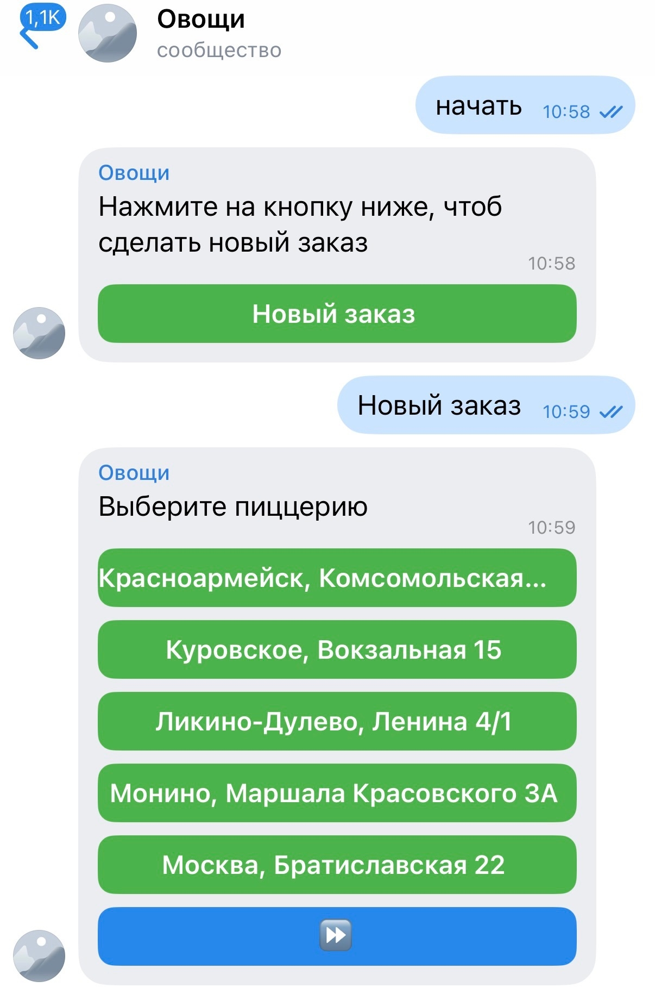
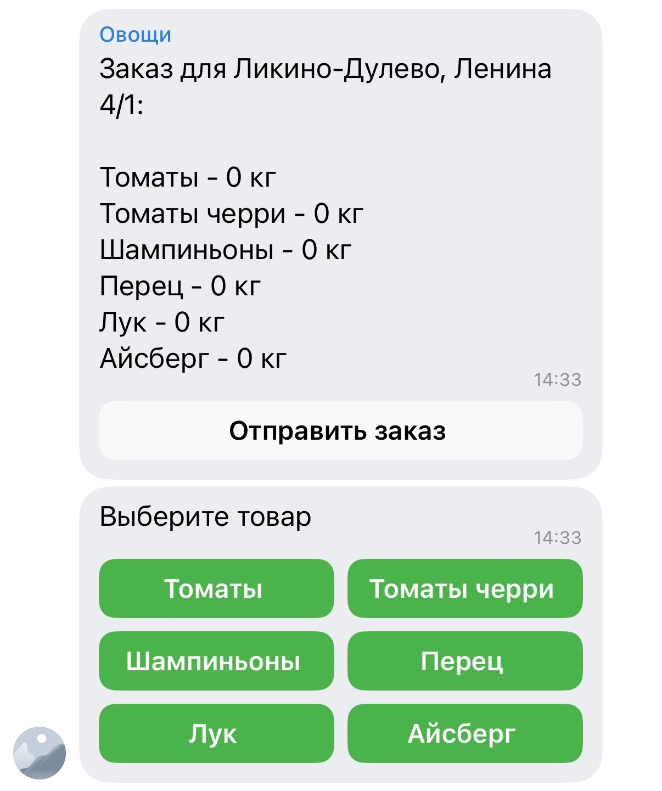
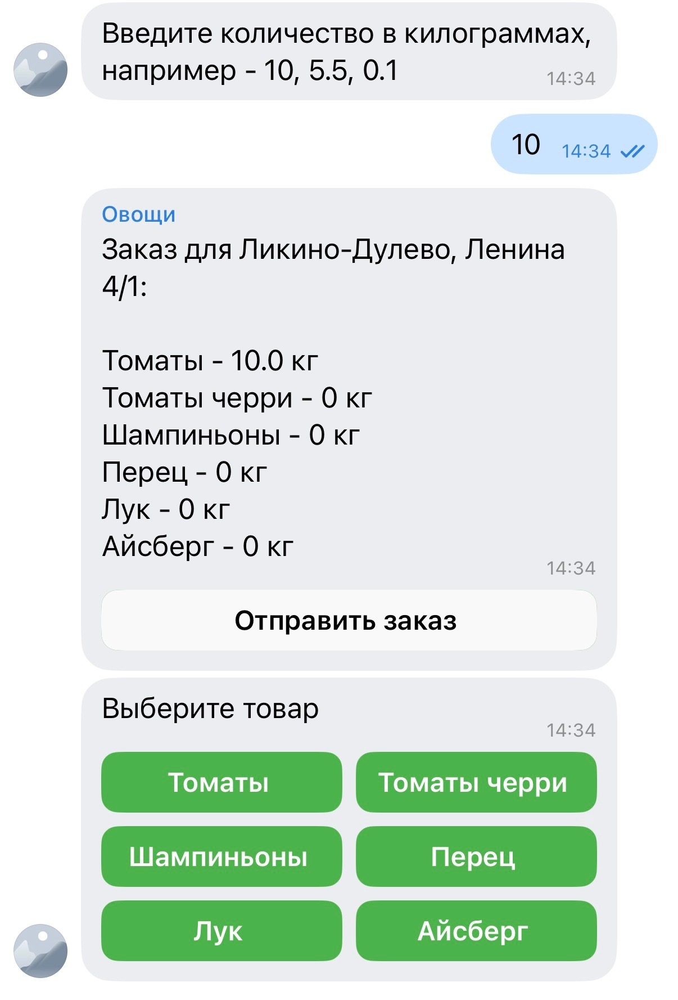
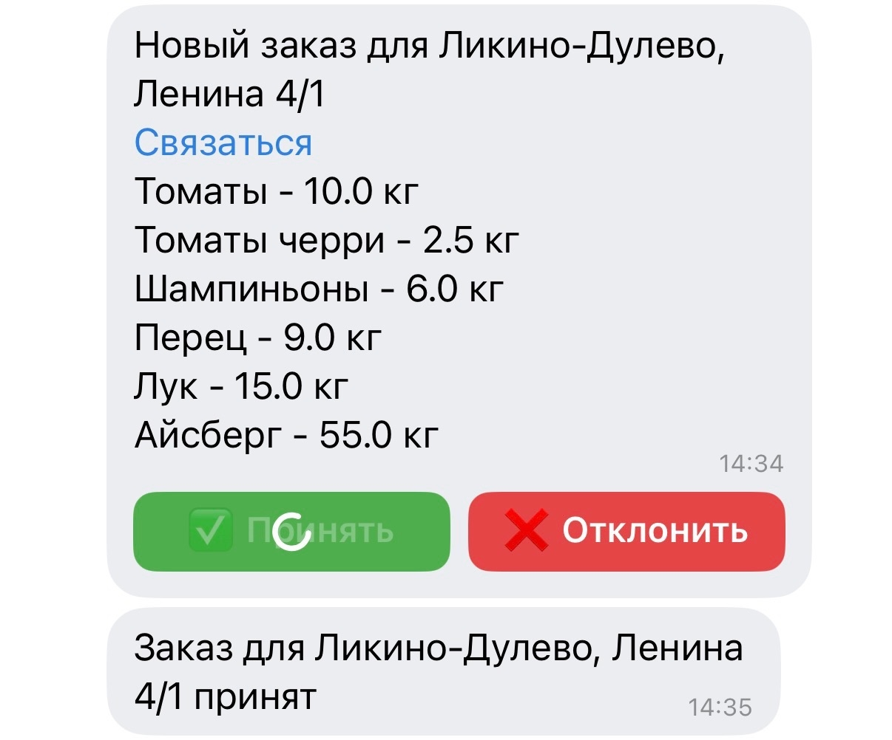

# Vegetables Order Bot

Бот для оформления заказов овощей между пиццериями и последующего согласования заказа администратором.

Проект создан для автоматизации оформления заказов между точками общественного питания.

## Возможности

### Пользователь

- оформление заказа;
- выбор точки;
- выбор товаров;
- отправка заказа.

### Администратор

- согласование заказов;
- просмотр сводки;
- очистка сводки;
- добавление точек;
- удаление точек.

## Скриншоты

### Выбор пиццерии



### Формирование заказа




### Согласование заказа




## Стек

- Python 3.x
- vkbottle
- JSON (временное хранилище данных)

## Архитектура

Бот построен на событийной модели vkbottle.

Состояние пользователя хранится в FSM:
- стартовое состояние;
- выбранная пиццерия;
- текущий товар;
- ввод количества;
- создание точки;
- удаление точки.

Интерфейс реализован через callback-кнопки и inline-клавиатуры.

## Структура проекта

```text
BotVegetables/
├── data/ - файлы хранения данных.
│   ├── adress.json
│   ├── vegetables.json
│   └── orders.json
│
├── handlers/ - обработчики сообщений и callback-событий.
│   ├── admin.py
│   ├── order.py
│   └── start.py
│
├── services/ - бизнес-логика и вспомогательные функции.
│   ├── notifications.py
│   ├── order.py
│   ├── prepare_data.py
│   └── renders.py
│
├── config.example.py
├── keyboards.py
├── loader.py
├── main.py
├── states.py
├── storage.py
└── requirements.txt
```

## Текущее состояние

Проект находится в активной разработке.

Планируется:
- перенос хранения данных в SQLite;
- система напоминаний о заказах;
- расширение административного интерфейса;
- журнал истории заказов.

## Запуск

1. Установить зависимости:

pip install -r requirements.txt

2. Создать VK-группу и получить токен сообщества.

3. Создать файл config.py на основе config.example.py

4. Вставить токен и числовой id администраторов в config.py.

5. Запустить:

python main.py
